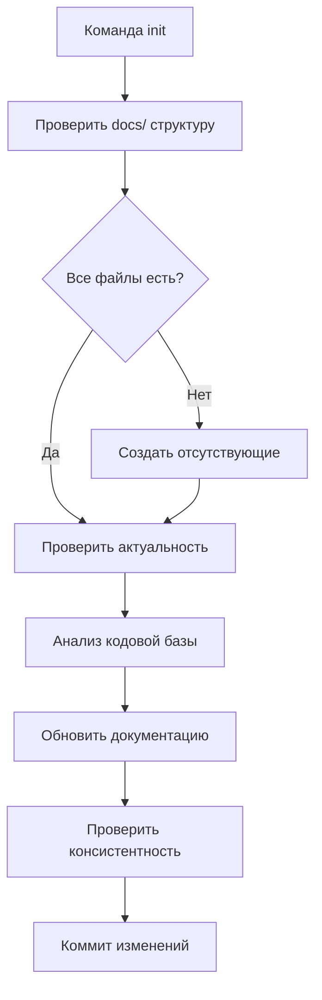
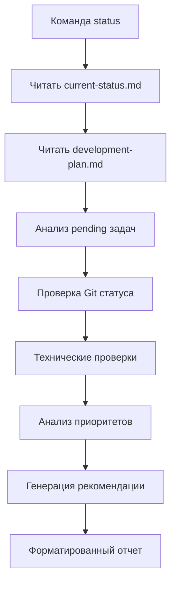
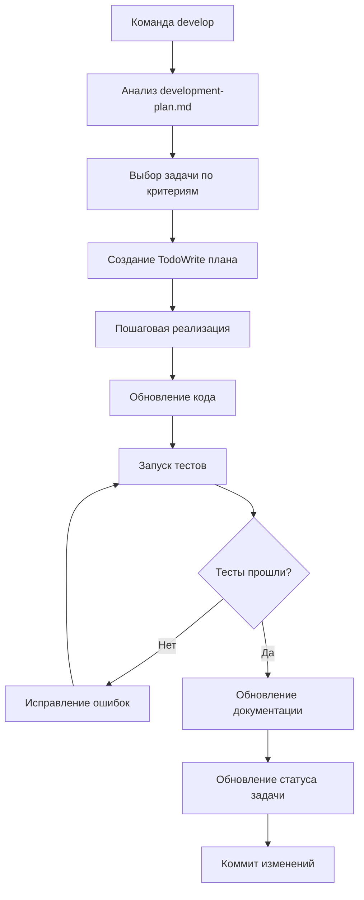
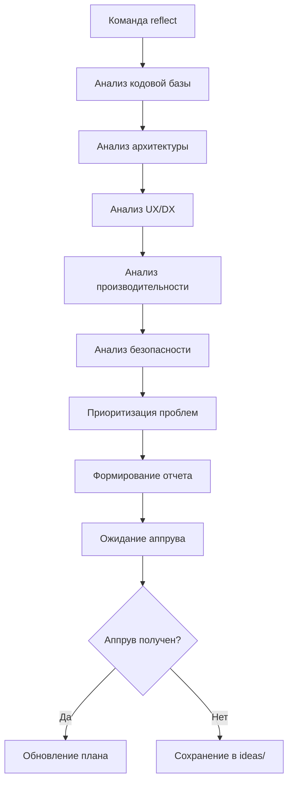
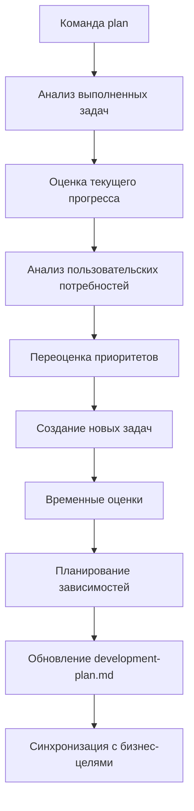

# 🔄 Smart Goal Calendar - Рабочие процессы

## 🚀 Основные workflow

### 🎯 Workflow: `init` - Инициализация проекта

**Триггер**: Первый запуск или проверка структуры
**Цель**: Убедиться что все необходимые файлы существуют и актуальны



**Шаги выполнения**:
1. **Проверка обязательных файлов**:
   - `docs/current-status.md`
   - `docs/development-plan.md`
   - `docs/architecture.md`
   - `docs/project.md`
   - `docs/README.md`
   - `CHANGELOG.md`

2. **Создание отсутствующих файлов**:
   - Базовая структура с заголовками
   - Placeholder контент
   - Датировка создания

3. **Актуализация содержимого**:
   - Сравнение с реальным кодом
   - Обновление статистики
   - Проверка ссылок

4. **Валидация архитектуры**:
   - Соответствие Clean Architecture
   - Проверка Go/React структуры
   - Консистентность типов

5. **Финализация**:
   - Обновление CHANGELOG.md
   - Создание git коммита

---

### 📊 Workflow: `status` - Анализ состояния

**Триггер**: Начало рабочей сессии
**Цель**: Быстро понять текущее состояние и получить рекомендацию



**Алгоритм принятия решений**:
```
IF критические проблемы > 0 THEN
    рекомендация = "reflect"
ELSE IF pending critical задач > 0 THEN
    рекомендация = "develop"
ELSE IF время с последней рефлексии > 14 дней THEN
    рекомендация = "reflect"
ELSE IF готовность > 85% AND plan исчерпывается THEN
    рекомендация = "innovate"
ELSE
    рекомендация = "develop"
```

**Технические проверки**:
1. **Backend (Go)**:
   - `go test ./...` статус
   - `go vet ./...` чистота
   - Компиляция API

2. **Frontend (React)**:
   - TypeScript проверки
   - ESLint статус
   - Build успешность

3. **Интеграции**:
   - Google Calendar настройки
   - Database connectivity
   - PWA функциональность

---

### 💻 Workflow: `develop` - Разработка задачи

**Триггер**: Есть готовые к реализации задачи
**Цель**: Выполнить следующую приоритетную задачу



**Критерии выбора задач**:
1. **Приоритет** (Critical > High > Medium > Low)
2. **Готовность зависимостей** (все prerequisite выполнены)
3. **ROI** (соотношение пользы к затратам)
4. **Техническая готовность** (есть ли необходимые инструменты)

**Процесс реализации**:
1. **Планирование**:
   - Разбивка на подзадачи
   - Оценка времени
   - Определение критериев завершения

2. **Реализация**:
   - Следование техническим стандартам
   - Continuous testing
   - Code review принципы

3. **Валидация**:
   - Unit tests (если применимо)
   - Integration tests
   - Manual testing

4. **Документирование**:
   - Обновление архитектурной документации
   - API документация
   - Changelog записи

---

### 🔍 Workflow: `reflect` - Системная рефлексия

**Триггер**: Раз в 2 недели или накопление технического долга
**Цель**: Глубокий анализ с предложениями улучшений



**Области анализа**:

1. **Backend (Go) анализ**:
   - Clean Architecture соблюдение
   - SOLID принципы
   - Error handling patterns
   - Test coverage анализ
   - Performance bottlenecks
   - Security vulnerabilities

2. **Frontend (React) анализ**:
   - Component architecture
   - TypeScript coverage
   - Bundle size optimization
   - Accessibility compliance
   - Performance metrics
   - UX/UI consistency

3. **Интеграционный анализ**:
   - Google Calendar sync эффективность
   - PWA capabilities
   - Offline functionality
   - Error recovery mechanisms

4. **DevOps анализ**:
   - CI/CD pipeline эффективность
   - Docker optimization
   - Monitoring coverage
   - Deployment strategy

**Формат отчета**:
```markdown
# 🔍 Системная рефлексия Smart Goal Calendar - [Дата]

## 🚨 Критические проблемы (Priority: Critical)
- [Проблема] - [Влияние] - [Рекомендация]

## 🏗️ Архитектурные улучшения (Priority: High)
- [Улучшение] - [Обоснование] - [План реализации]

## ⚡ Оптимизации производительности (Priority: Medium-High)
- [Оптимизация] - [Ожидаемый эффект] - [Сложность]

## 🎨 UX/DX улучшения (Priority: Medium)
- [Улучшение] - [Пользователи] - [ROI]

## 📊 Метрики качества
- Test Coverage: Backend X%, Frontend Y%
- TypeScript строгость: Z%
- Bundle size: X MB
- Lighthouse score: Y
- Security score: Z

## 📋 Приоритизированные рекомендации
1. [Top Priority] - [Обоснование]
2. [High Priority] - [Обоснование]
...
```

---

### 📋 Workflow: `plan` - Планирование roadmap

**Триггер**: Завершение этапов или изменение приоритетов
**Цель**: Обновить план разработки



**Источники для планирования**:
1. Completed задачи из development-plan.md
2. Результаты reflect команд
3. Пользовательская обратная связь
4. Технические ограничения
5. Бизнес приоритеты

---

## 🔧 Технические workflow

### ✅ Workflow: `test` - Тестирование

```bash
# Backend тестирование
cd /path/to/project
go test ./...
go vet ./...
go test -race ./...

# Frontend тестирование  
cd web
npm run lint
npm run typecheck
npm run test
npm run build
```

### 🛠️ Workflow: `lint` - Проверка качества

```bash
# Backend linting
golangci-lint run
go fmt ./...

# Frontend linting
cd web
npm run lint
npm run lint:fix  # автофикс
```

### 📦 Workflow: `build` - Сборка

```bash
# Backend build
go build -o bin/api cmd/api/main.go

# Frontend build
cd web
npm run build
npm run preview  # тестирование сборки
```

---

## 🐛 Bug Management Workflows

### 🐛 Workflow: `bug` - Создание репорта

**Интерактивный процесс**:
1. **Сбор информации**:
   - Описание проблемы
   - Шаги воспроизведения
   - Ожидаемое поведение
   - Фактическое поведение
   - Окружение (browser, OS, версии)

2. **Классификация**:
   - Приоритет (Critical/High/Medium/Low)
   - Компонент (Backend/Frontend/Integration)
   - Тип (Bug/Enhancement/Task)

3. **Создание issue**:
   - Добавление в development-plan.md
   - Labeling и приоритизация
   - Assignment (если применимо)

### 📝 Workflow: `bug-list` - Анализ багов

```markdown
# 🐛 Активные баги Smart Goal Calendar

## 🚨 Critical (Блокирующие)
- [ ] [Bug ID] [Заголовок] - [Компонент] - [Дата создания]

## ⚠️ High (Важные)
- [ ] [Bug ID] [Заголовок] - [Компонент] - [Дата создания]

## 📋 Medium (Обычные)
- [ ] [Bug ID] [Заголовок] - [Компонент] - [Дата создания]

## 📝 Low (Минорные)
- [ ] [Bug ID] [Заголовок] - [Компонент] - [Дата создания]
```

### 🔧 Workflow: `bug-fix` - Исправление

1. **Выбор бага**: По приоритету и ready-to-fix статусу
2. **Анализ**: Root cause analysis
3. **Планирование**: TodoWrite с планом исправления
4. **Реализация**: Следование develop workflow
5. **Тестирование**: Regression testing
6. **Валидация**: Bug reproduction невозможен
7. **Закрытие**: Обновление статуса и документации

---

## 📚 Documentation Workflows

### 📖 Workflow: `docs-sync` - Синхронизация документации

**Проверки актуальности**:
1. **Архитектурная документация**:
   - Соответствие реальной структуре кода
   - Актуальность диаграмм
   - Корректность API описаний

2. **План разработки**:
   - Статусы задач соответствуют реальности
   - Приоритеты актуальны
   - Временные оценки обновлены

3. **Технические гайды**:
   - Инструкции работают
   - Версии зависимостей актуальны
   - Ссылки не сломаны

### 📝 Workflow: `changelog` - Обновление истории

**Автоматическое добавление**:
- При выполнении команд CLAUDE.md
- При завершении значительных фич
- При исправлении критических багов
- При изменении API

**Формат записи**:
```markdown
## [Дата] - Выполнение команды "[команда]"

### Выполненные действия:
- [Детальное описание действий]

### Изменения в системе:
- [Новые возможности]
- [Исправленные проблемы]

### Результаты:
- [Измеримые результаты]
```

---

## ⚡ Quick Workflows

### 🚀 `quick-fix` = `status` → `develop` → `test` → `commit`

**Применение**: Быстрые исправления без глубокого анализа
**Ограничения**: Только для простых задач до 30 минут

### 🔍 `full-check` = `lint` + `test` + `audit` + `docs-sync`

**Применение**: Перед релизом или важным коммитом
**Цель**: Убедиться в готовности кода

---

## 🎯 Smart Goal Calendar Specific Workflows

### 📅 Workflow: `calendar-sync` - Проверка Google Calendar

1. **OAuth2 flow тестирование**
2. **Bi-directional sync проверка**
3. **Webhook functionality валидация**
4. **Conflict resolution тестирование**
5. **Performance sync операций**

### 🎯 Workflow: `goals-test` - SMART Goals проверка

1. **SMART validation тестирование**
2. **Progress tracking accuracy**
3. **Task/milestone management**
4. **Goal scheduling optimization**

### 😊 Workflow: `mood-analytics` - Mood система

1. **5-level tracking validation**
2. **Analytics calculation проверка**
3. **Correlation algorithms тестирование**
4. **Privacy compliance проверка**

### 📱 Workflow: `pwa-check` - PWA функциональность

1. **Offline functionality**
2. **Service Worker operation**
3. **Manifest validation**
4. **Installation flow**
5. **Push notifications setup**

---

## 📐 Принципы workflow

1. **Измеримость**: Каждый workflow имеет четкие критерии завершения
2. **Воспроизводимость**: Можно повторить любой процесс
3. **Документированность**: Все действия фиксируются
4. **Автоматизация**: Максимальное использование инструментов
5. **Качество**: Тестирование на каждом этапе
6. **Безопасность**: Проверки безопасности встроены

## 🔗 Связанные файлы
- `.ai/commands.md` - Список всех команд
- `.ai/technical.md` - Технические стандарты
- `docs/development-plan.md` - Текущий план
- `CHANGELOG.md` - История изменений